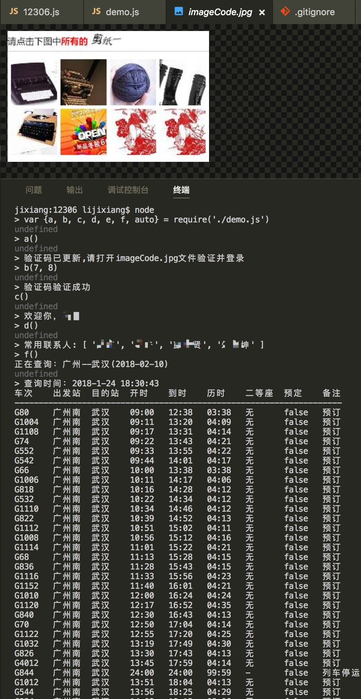

# 12306
nodejs版的12306网站部分业务代码，有兴趣的可扩展成web版或PC版（electron）的刷票软件。以后尝试下单刷票功能

## 使用
1. npm install
2. 配置config.js内12306的用户名密码，供有登录需求使用
3. 如下测试demo
```bash
$ node
> var {a, b, c, d, e, f, auto} = require('./demo.js')
> a()   // 打开imageCode.jpg图片，比如答案是第一张小图和第八张小图
> auto(1, 8)  // 输入验证码并登陆，获取常用联系人列表
```

## 示例


### 功能列表
- [x] 条件查询车次信息
- [x] 登录
- [x] 获取联系人信息
- [ ] 提交订单
- [ ] 自动识别二维码

### 目录结构
- `12306.js`: 实现12306网站的逻辑代码文件
- `imageCode.jpg`: 12306验证码，当登录或提交订单时用到
- `demo.js`: 测试代码
- `initStations.js`: 更新全国火车站信息(当前更新时间2017-01-22，如果有查不到的火车站时，执行`node initStations`更新全国火车站信息)
- `service.js`: 12306网站请求的基本配置
- `config.js`: 配置12306账号，密码
